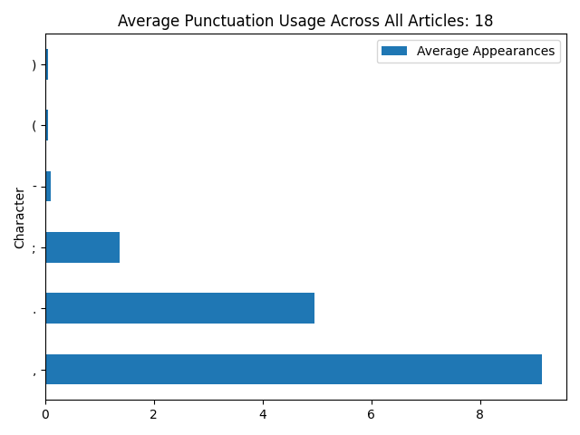

# Authorship of the Federalist Papers

Author: Toby Surtees

## Problem Description

### What are The Federalist Papers?

The Federalist Papers are a collection of 85 essays written by Alexander Hamilton, James Madison, and John Jay under the pseudonym '*Publius*' in 1787-88. The aim of these articles was to persuade New Yorkers to support ratification of the US Constitution.

Examples of ideas in The Federalist Papers include opposition to the Bill of Rights (Federalist No. 84) over dangers of limiting the rights that people had to those only appearing in the bill, giving the govenment power to infringe on rights not listed, as well as topics on foerign influence, interstate conflict, power and taxation and most extensively the US Constitution and Power of Congress and structure of the new federal government.

### Disputed Authorship

At the time of publication, the authors of the Federalist Papers attempted to hide their identities by using the collective pseudonym '*Publius*', leading to conflicting ideas of who wrote each essay. Today, researchers generally agree on the authors of the essays; however, the remaining 12 remain disputed between Hamilton and Madison.

The modern consensus is as follows:

- **Hamilton**: 51 Articles numbering 1, 6-9, 11-13, 15-17, 21-36, 59-61, 65-85.
- **Madison**: 29 Articles numbering 10, 14, 18-20, 37-58, 62-63.
- **Jay**: 5 Articles numbering 2-5, 64.

The disputed 12 articles are around the authorship of articles 49-58 (*Madison*), 18-20 (*Madison and Hamilton*) and 64 (*Jay*), with conflicting claims from Hamilton, claiming 63 essays including 3 joint with Madison, while Madison claims 29 essays for himself citing rushed clerical work after the death of Hamilton in 1804.

Most modern research strongly favours Madison's claim of authorship over that of Hamilton, but the debate is not considered fully closed.

## Project Aims

The aim of this project is to contribute to the research around the federalist papers by using Linguistics and Natural Language Processing (NLP) methods to attempt to decern who of the three authors is most likely to have written the 12 disputed papers.  

At the stage of writing, this will mostly consist of comparison and statistical analysis of the text by looking at other works of the authors and comparing writing style and commmonalities between each work, as well as other confirmed articles in the same paper.

## Notes on Methodology

1. *LLM or Bayesian Models* - Research into this specific case has shown no significant performance improvement of using Large Language Models (LLMs) against more traditional Bayesian or Topical Models (3), suggesting the best route for this project is a more typical Bayesian approach.
2. *Feature Selection* - In tasks like this one, where writing style is the main differentiator between authors, feature selection is critical in producing useful results. Previous approaches have included using only function words (3,4), less affected by subject matter and thus better for attributing authorship. Specifically, Topic Embeddings of Function Words have been shown to give the best attribution performance (3).
3. *Stylistic Signals* - Looking beyond word frequency into stylistic signals such as rhetoric and discourse structure can help in article attribution (1), a potential path for exploring beyond statistical analysis.
4. *Types of Classification* - Using multiple types of classification and combining the results can increase the robustness of results (5), so I should explore using more than one classification technique.

## Language and Technique

Python is the obvious choice for this project. I'm familiar with the language, and it also includes many powerful libraries for NLP and text analysis. It also includes many testing tools for code correctness.

Supervised learning seems like the best choice for this application, as we have plenty of options for other works attributed to each author, without disputes over authorship. This means I can compare these knowing for a fact who wrote them, and use them as a comparison to the disputed articles. This also works for other articles in The Federalist Papers where authorship is not contested. I will use both in this project.

### Features

1. *Lexical Features* - Average number of words per sentence, Sentence Length and Variation, Lexical Diversity.
2. *Punctuation Features* - Average number of commas, semicolons and colons per sentence.
3. *Bag-of-Words* (BoW) - Frequencies of different words in each article using *topic-independent* keywords for better analysis across different papers and subjects.
4. *Syntactic Features* - Lexical categories and feature labelling, Part-of-Speech (POS).

## Results

### The First Results - Punctuation Analysis

The first major results for this project come from punctuation analysis confined to the articles in the paper only. Punctuation analysis is the first step in stylistic analysis, and by looking at the punctuation usage of each author, we can take a step towards establishing a writing style for each individual, allowing direct comparison to that used in each article. Using this method means that we can then compare which style most closely resembles that which is used in each article, giving us a better idea of which author was responsible for writing a particular article.

For the first step into punctuation analysis, I have restricted my search to The Federalist Papers only as a first step. Naturally, this means the next logical step is to expand the analysis to previous works of each author, building up the author styles I previously mentioned. However, for now, I have used this current data and run a preliminary comparison to see if I'm heading in the correct direction. The metrics for this comparison consist of a comparison between total punctuation usage per 100 words of each article, per author, across the entire publication. I then used Total Absolute Difference (TAD), which consists of taking the difference of the author's total average across all papers (Average function usage of all undisputed papers attributed to one author across all papers) against the average of each individual contested paper.

As an example, take Article 18. The graph shows the punctuation usage across the article per sentence. I take an average of these values across 100 words to get a normalized average. I then take the total average of each author, take Hamilton as an example, and compute the difference between that total average and the average of Article 18 across each type of punctuation. The results can be seen in the following figure.



``` utf-8
article         ,         .         ;         (         )         -          :         ?         `         '    author
     18  1.522752  1.810324  0.575827  0.077005  0.077005  0.114279        NaN       NaN       NaN       NaN  HAMILTON
```

I then take the sum of each of these differences to get the TAD, which works out to be 4.177193 for this particular article and author. Repeating this for each author, we also get the values 4.005356 for Jay and 3.045500 for Madison. We then compare these values and take the lowest value, as this represents the closest match to the overall punctuation usage for an author and that used in the particular article. So in the case of Article 18, we attribute Madison, as his TAD is closest to 0.

Repeating this for every disputed paper, we get the following results.

``` utf-8
          HAMILTON_TAD   JAY_TAD  MADISON_TAD Best Match
article
18           4.177193  4.005356     3.045500    MADISON
19           5.186822  4.994623     4.094340    MADISON
20           5.694233  5.395003     4.575195    MADISON
49           1.705146  2.290675     2.108466   HAMILTON
50           4.397100  4.108221     4.082052    MADISON
51           1.164875  2.187222     2.103554   HAMILTON
52           1.699144  1.678109     1.311747    MADISON
53           1.335050  1.245165     0.918898    MADISON
54           1.278345  1.320628     1.033813    MADISON
55           0.789800  1.657792     1.750226   HAMILTON
56           2.056060  2.641643     2.623698   HAMILTON
57           3.133577  4.182924     4.199794   HAMILTON
58           1.322836  1.456486     1.253914    MADISON
64           2.584629  1.598785     2.071018        JAY
```

You will notice that this does not line up exactly with the modern-day consensus, but this is exactly what I expected, as this is only one piece of the larger puzzle. However, these results do show promise, as some of the results do match up, leading me to believe that, as a method of exploration, punctuation usage and style are a worthwhile avenue to explore more deeply.

As I mentioned earlier, the next logical step would be to expand this search to works outside of The Federalist Papers, as well as to build more on this stylistic profile for each author.

## References

[1]Collins, J. et al. (2004) ‘Detecting Collaborations in Text Comparing the Authors’ Rhetorical Language Choices in The Federalist Papers’, Computers and the Humanities, 38(1), pp. 15–36. Available at: <https://doi.org/10.1023/B:CHUM.0000009291.06947.52>.

[2]Fung, G. (2003) ‘The disputed federalist papers: SVM feature selection via concave minimization’, in Proceedings of the 2003 conference on Diversity in computing. TAPIA03: Richard Tapia Celebration of Diversity in Computing Conference, Atlanta Georgia USA: ACM, pp. 42–46. Available at: <https://doi.org/10.1145/948542.948551>.

[3]Jeong, S.W. and Ročková, V. (2025) ‘From Small to Large Language Models: Revisiting the Federalist Papers’. arXiv. Available at: <https://doi.org/10.48550/arXiv.2503.01869>.

[4]Mosteller, F. and Wallace, D.L. (2012, 1984) Applied Bayesian and Classical Inference: The Case of The Federalist Papers. Springer Science & Business Media.

[5]Savoy, J. (2013) ‘The Federalist Papers revisited: A collaborative attribution scheme’, Proceedings of the American Society for Information Science and Technology, 50(1), pp. 1–8. Available at: <https://doi.org/10.1002/meet.14505001036>.

## Credits

All credit for 'The Federalist Papers' resource used in this project goes to <https://www.gutenberg.org/>, where the documents are available to download for free.

The list of function words used in this project is credited to James O’Shea and is available at <https://semanticsimilarity.wordpress.com/function-word-lists/>.
